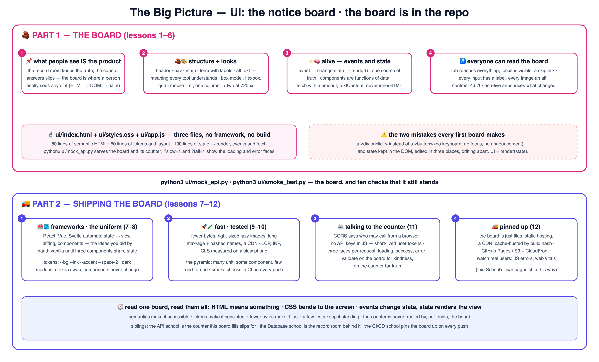

# 📌 Learn UI the School Way — the notice board

The school method — proven on
[AWS](https://github.com/BaluRaut/learn-aws-school),
[Kubernetes](https://github.com/BaluRaut/learn-kubernetes-school),
[APIs](https://github.com/BaluRaut/learn-api-school) and the rest of
[The School](https://baluraut.github.io/school/) — applied to **user interfaces**:
what people actually see, taught as the school's **notice board** — structure,
looks, and what happens when someone touches it.

What makes this course different: **the board is IN the repo.** A real web app in
three plain files — HTML, CSS, JavaScript, no framework and no build step — plus a
tiny counter to talk to, that every lesson reads, breaks and improves.

🌐 **Interactive site:** **<https://baluraut.github.io/learn-ui-school/>** —
lesson cards, every lesson as a numbered diagram, the big-picture 4K, a quiz, a
study plan and the before-and-trade-offs page.

> 🎒 **Prerequisites:** a browser and Python 3 (only for the tiny counter the board
> talks to). No Node, no npm, no framework. Good neighbours: the
> [API school](https://github.com/BaluRaut/learn-api-school) (the counter this board
> fills slips for) and the [CI/CD school](https://github.com/BaluRaut/learn-cicd-school)
> (how the board gets pinned up).

## 🚀 The 60-second wow

```bash
python3 ui/mock_api.py        # terminal 1: the board + its counter on http://127.0.0.1:8000
python3 ui/smoke_test.py      # terminal 2: 10 checks — lang, h1, labels, alt, tokens, focus, the API
```

Open the board, filter a class, enrol a student, toggle dark mode, press Tab from
the top — every lesson of the course is visible in one page.

## 🗺️ The big picture



## 🎓 The 12 lessons

Each numbered branch adds ONE lesson folder (`lessons/NN-topic/README.md`) with an
explain-like-I'm-5 story, a school analogy, a diagram, **What / Why / How**, a
hands-on lab on the real board, and Verify / What-you-proved / Common-mistakes
sections. Branches are **sequential** — branch 07 contains lessons 01–07.

```bash
git checkout lesson-01-why-ui            # read lessons/01-why-ui/README.md, then...
git checkout lesson-02-html-structure    # ...keep going, one branch at a time
```

### Part 1 — the board 🧱

| # | Branch | You learn | Analogy |
|---|---|---|---|
| 01 | `lesson-01-why-ui` | The browser, the DOM, the three files | The notice board 📌 |
| 02 | `lesson-02-html-structure` | Semantic elements, forms, labels, alt | The board's skeleton 🧱 |
| 03 | `lesson-03-css-layout` | Box model, flexbox, grid, responsive | The board's layout 🎨 |
| 04 | `lesson-04-javascript-events` | Events, DOM updates, fetch, async | The board comes alive ⚡ |
| 05 | `lesson-05-state-components` | One source of truth, UI = render(state) | The master list 🧠 |
| 06 | `lesson-06-accessibility` | Keyboard, labels, contrast, focus, ARIA | Everyone can read it ♿ |

### Part 2 — shipping it 🚚

| # | Branch | You learn | Analogy |
|---|---|---|---|
| 07 | `lesson-07-frameworks` | React, Vue, Svelte — what they automate | The same ideas, automated 🧰 |
| 08 | `lesson-08-design-tokens` | Tokens, spacing, type, dark mode | The school uniform 🎽 |
| 09 | `lesson-09-performance` | Bundles, images, caching, Web Vitals | The board loads fast 🚀 |
| 10 | `lesson-10-testing` | Unit, component, end-to-end, visual | Does the board still stand? 🧪 |
| 11 | `lesson-11-talking-to-backends` | CORS, tokens, loading/error states, XSS | Filling in the counter's slips 📨 |
| 12 | `lesson-12-build-deploy-observe` | Static hosting, CDN, cache busting, monitoring | Pinning the board up 🚚 |

## 📦 What's in this repo (main branch)

```
learn-ui-school/
├── ui/
│   ├── index.html            # the notice board — semantic HTML, ~80 lines
│   ├── styles.css            # tokens, layout, components, dark mode — ~60 lines
│   ├── app.js                # state → render, events, fetch — ~100 lines, no framework
│   ├── mock_api.py           # the tiny counter it talks to (+ ?slow=1 and ?fail=1)
│   ├── smoke_test.py         # 10 zero-dependency checks: a11y, tokens, the API
│   └── tests/board.spec.js   # the same intent in Playwright (illustrative)
└── docs/                     # the GitHub Pages site
```

Everything runs on your laptop. **Cost: zero.**

## 📜 License

MIT — see [LICENSE](LICENSE). Analogies are free to reuse; attribution appreciated.
