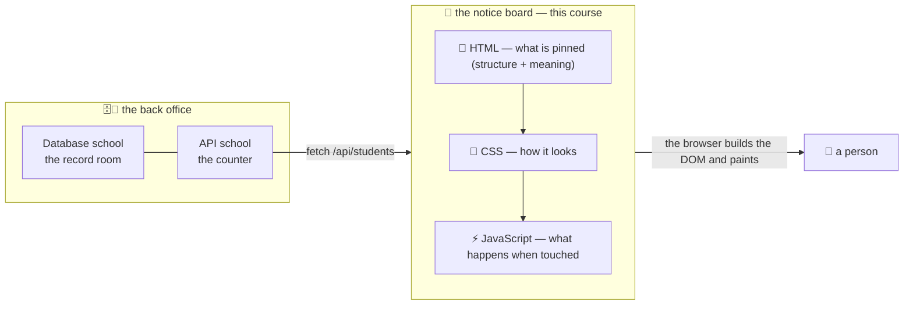

# 📌 Lesson 01 — Why UI: the notice board

**📍 You are here:** Lesson **01** of 12 · Next: `lesson-02-html-structure`

---

## 📦 What's in this branch

The thing every other school builds *towards* — and the three files that
make it. Real files you will use all the way through:

- [ui/index.html](../../ui/index.html) — the notice board itself (~80 lines)
- [ui/styles.css](../../ui/styles.css) — the uniform and the layout (~50 lines)
- [ui/app.js](../../ui/app.js) — state, events and fetch (~90 lines, no framework)
- [ui/mock_api.py](../../ui/mock_api.py) — a tiny counter for the board to talk to

> 🎒 **Before you start:** you need a **browser** and **Python 3** (only to
> serve the board and its little counter). No Node, no npm, no framework, no
> build step. Good neighbours: the
> [API school](https://baluraut.github.io/learn-api-school/) (the counter this
> board fills slips for) and the
> [CI/CD school](https://baluraut.github.io/learn-cicd-school/) (how a board
> gets pinned up). **What this is not:** a React course — lesson 07 shows what
> frameworks automate *after* you have done it by hand.

## 🧒 Explain like I'm 5

The school has a beautiful **record room** 🗄️ (the Database school) and a
polite **front office** 🏢 (the API school). A parent walks in… and sees
nothing. There is no **notice board**.

So the school pins one up 📌. On it: the class list, a form to enrol a new
student, a note about what the board is. The board is made of three things,
and it is worth separating them in your head on day one:

1. **HTML — what is pinned up.** The list, the form, the headings. Structure
   and *meaning*: this is a heading, that is a button, this is a list of five
   students.
2. **CSS — how it looks.** Colours, spacing, two columns on a wide wall and
   one on a phone. Nothing about meaning; everything about presentation.
3. **JavaScript — what happens when someone touches it.** Filter the list,
   submit the form, fetch fresh names from the counter.

The browser reads the HTML and builds a **tree of objects** — the **DOM** —
then paints it. CSS decorates the tree; JavaScript changes it. Everything in
this course is one of those three, or how they travel to a person.

And the reason the board matters more than it looks: **what people see IS
the product.** The record room could be perfect and the counter fast, and if
the board is confusing, unusable with a keyboard, or slow on a phone, the
school is broken for the only people it exists for.

## 🗺️ Diagram



## ❓ What

- **The browser** downloads HTML, parses it into the **DOM** (a tree of
  nodes), applies CSS to produce a render tree, and paints. JavaScript can
  change the DOM at any time; the browser repaints.
- **HTML** = structure and meaning (semantics — lesson 02). **CSS** = looks
  and layout (lesson 03). **JavaScript** = behaviour (lessons 04–05).
- **DevTools** (F12 / right-click → Inspect) shows all three live: the
  Elements panel is the DOM, Styles is the CSS that won, Console runs JS,
  Network shows every slip sent to a counter.
- The board is **just files** — HTML, CSS, JS — which is why lesson 12 can
  pin it up on any static host in a minute.
- A "web app", a "single-page app", a "React app" are all this, with more
  machinery. Nothing in a framework escapes DOM + CSS + events.

## 🤔 Why

Because the UI is where correctness becomes *usefulness*. Every other school
in this series makes something true; this one makes it **seen, understood
and operable** — including by people using a keyboard, a screen reader, or a
five-year-old phone on a slow train.

## 🔧 How (in this repo)

`ui/mock_api.py` serves the three files *and* a tiny `/api/students` counter,
so the board behaves exactly as it would in production, on your laptop.

## 🧪 Try it (60 seconds — the whole course, live)

```bash
python3 ui/mock_api.py          # terminal 1 → http://127.0.0.1:8000/
python3 ui/smoke_test.py        # terminal 2 → ten checks
```

Then, in the browser: filter a class, enrol a student, click 🌙 Dark, press
**Tab** from the very top (a hidden "Skip to content" link appears first),
and open DevTools → Elements to watch the DOM change as you filter.

You should see, from the smoke test:

```text
✅ lang attribute on <html>      ✅ one <h1>          ✅ every input has a label
✅ images have alt               ✅ skip link + live region
✅ design tokens defined         ✅ dark theme via tokens    ✅ focus is visible
✅ API returns students          ✅ API rejects a bad form (400)
🎉 the board stands
```

## ✅ Verify — what you should see

The board lists five students; the class filter narrows it without a page
reload; enrolling adds a card and prints "… is on the board."; the smoke test
ends with `🎉 the board stands`. In DevTools → Network you can see the single
`GET /api/students` the board makes on load.

## 🏁 What you just proved

A real, interactive, accessible web app is three text files and a browser — and you can already see all three parts working together.

## ⚠️ Common mistakes

- opening `ui/index.html` directly from the file system — `fetch` to the counter is blocked; always serve it with `python3 ui/mock_api.py`
- editing files and not seeing changes — hard-reload (Cmd/Ctrl + Shift + R); lesson 09 explains the cache
- thinking "UI" means "design" — it is structure, behaviour and access, of which visual design is one part

> 🏭 **Why this matters in production:** every incident that users actually notice happens here: a form that cannot be submitted on a phone, a button a screen reader cannot find, a page that takes eight seconds on 3G. The back office is invisible; the board is the product.

## ⏭️ Next

What exactly should be pinned, and in what shape? **HTML structure** —
semantic elements, forms, labels and alt text.

```bash
git checkout lesson-02-html-structure
```
