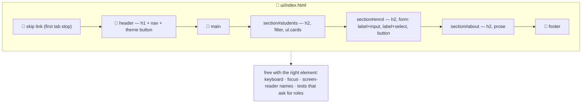

# 🧱 Lesson 02 — HTML structure: the board's skeleton

**📍 You are here:** Lesson **02** of 12 · Previous: `lesson-01-why-ui` · Next: `lesson-03-css-layout`

---

## 📦 What's in this branch

Lesson 01, **plus** the skeleton: **semantic elements** (landmarks), **forms
that mean it** (labels, required, types), and the small attributes that
decide whether anyone but a mouse user can use the board.

## 🧒 Explain like I'm 5

Two boards can look identical and be completely different underneath.

One is made of anonymous rectangles: `<div>` here, `<div>` there, a
`<div onclick>` painted to look like a button. The other names its parts:
this is the **header**, this is the **navigation**, this is the **main**
content, this is a **list** of five items, this is a **button**, and this
input's **label** is "Name".

Only the second board can be read by a screen reader ("list, five items…"),
operated with a keyboard (Tab reaches buttons and links, Enter presses them),
understood by a search engine, or tested by a robot that asks for "the button
named Enrol". You get all of that **for free** by choosing the element that
means what you mean.

The rules that matter on day one:

- `<html lang="en">` — what language the board is in (screen readers change
  pronunciation).
- One `<h1>`, then `<h2>`s under it — headings are the table of contents
  people navigate by.
- Landmarks: `<header>`, `<nav>`, `<main>`, `<section>`, `<footer>`.
- `<button>` for actions, `<a href>` for going places. Never a clickable
  `<div>`.
- Every `<input>`/`<select>` gets a `<label for="id">`. Placeholder is not a
  label — it disappears when you type.
- Every `` gets `alt` — a description, or `alt=""` if the image is pure
  decoration (like our avatars, which repeat the name next to them).

## 🗺️ Diagram



## ❓ What

- **Semantic elements** carry a **role** the browser exposes to assistive
  technology: `<button>` → button, `<nav>` → navigation, `<ul><li>` → list,
  `<main>` → main landmark. A `<div>` has role "generic" — nothing.
- **Forms**: `<label for="name">` ties the words to the field (clicking the
  label focuses it). Attributes are behaviour: `required`, `minlength`,
  `type="email"`, `autocomplete`. `<button type="submit">` submits;
  `type="button"` does not.
- **`<template>`**: inert HTML you clone in JavaScript — our student card
  lives there instead of in a JS string (lesson 04 uses it).
- **Attributes that are not decoration**: `lang`, `alt`, `title` on the page,
  `aria-live` on a status region (lesson 06), `for`/`id` pairs.
- **The document outline**: `h1` → `h2` → `h3` with no skipped levels. Screen
  reader users jump by heading the way sighted users skim.
- **Validation attributes** give you free browser checks *and* a hook for
  your own messages (`input.checkValidity()` in lesson 04).

## 🤔 Why

Because semantics are the cheapest accessibility, SEO and testability you
will ever buy: you type `<button>` instead of `<div>` and get keyboard
support, focus, roles and a name — for nothing. Retrofitting them later
means re-implementing the browser by hand with ARIA, badly.

## 🔧 How (in this repo)

Read [ui/index.html](../../ui/index.html) top to bottom — it is 80 lines and
every element was chosen for what it *means*: the skip link, the header with
one `h1`, three `section`s with their own `h2`, a form where every control
has a label, a `<template>` for the card, and `alt=""` on decorative avatars.

## 🧪 Try it

```bash
python3 ui/mock_api.py        # then open http://127.0.0.1:8000/
# 1) keyboard tour: press Tab from the top — skip link, nav links, theme button, filter, form fields, Enrol
# 2) break it on purpose: change <button type="submit"> to <div>Enrol</div>, reload, and try Tab + Enter
# 3) put it back, then remove the <label for="name"> and run:
python3 ui/smoke_test.py      # ❌ every input has a label
# 4) add a real section of your own: <section id="homework" aria-labelledby="hw-h"><h2 id="hw-h">Homework</h2>…</section>
```

## ✅ Verify — what you should see

Tab reaches every control in visual order and the focus ring is obvious. With
the `<div>`, Tab skips it entirely and Enter does nothing — the button was
doing four jobs you never wrote. The smoke test fails on the missing label and
passes again when you restore it.

## 🏁 What you just proved

The right element gives you keyboard, focus, roles and names for free — and a
robot can check that in ten lines.

## ⚠️ Common mistakes

- `<div onclick>` instead of `<button>` (no keyboard, no focus, no role)
- placeholder instead of `<label>`
- skipping heading levels, or three `<h1>`s "because they look right"
- decorative images with invented alt text — use `alt=""`
- `<br>` for spacing (that is CSS's job) and tables for layout

> 🏭 **Why this matters in production:** accessibility lawsuits, failed audits and "the tests are flaky because they select `.btn-3`" all trace back to this lesson. Tests that ask for roles and labels (lesson 10) survive redesigns; tests that ask for class names do not.

## ⏭️ Next

The skeleton is right; now make it look like something on every screen:
**CSS layout** — box model, flexbox, grid, responsive.

```bash
git checkout lesson-03-css-layout
```
