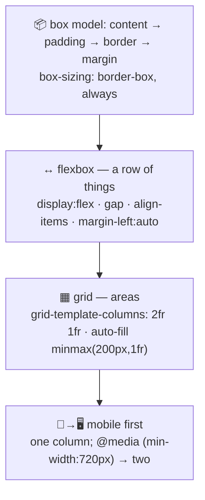

# 🎨 Lesson 03 — CSS layout: one board, every screen

**📍 You are here:** Lesson **03** of 12 · Previous: `lesson-02-html-structure` · Next: `lesson-04-javascript-events`

---

## 📦 What's in this branch

Lessons 01–02, **plus** how the board is arranged: the **box model**,
**flexbox** for a row of things, **grid** for a page of areas, and the
handful of habits that make one board work on a phone and on a wall.

## 🧒 Explain like I'm 5

Every element on the board is a **box** 📦, and a box has four layers from
the inside out: the **content**, the **padding** (space inside the frame),
the **border** (the frame), and the **margin** (space outside it). Set
`box-sizing: border-box` once at the top and a box's declared width is its
*outer* width — the way everyone actually thinks.

Then there are two ways to arrange boxes:

- **Flexbox** ↔️ — one line of things, sharing a row (or column). Our header
  is flex: the title, the nav, the theme button, with `gap` between them and
  `margin-left: auto` pushing the nav to the right. Use flex when you are
  thinking "these go in a row".
- **Grid** ▦ — a page of areas, rows *and* columns at once. Our `main` is
  grid: on a wide screen, "students" takes two fractions and "enrol" one; on
  a phone, one column. Use grid when you are thinking "this area, that area".

And the rule that makes the board work everywhere: **write the phone layout
first**, then add columns for bigger screens with a media query. Relative
units (`rem`, `%`, `fr`) stretch; fixed pixel widths do not.

## 🗺️ Diagram



## ❓ What

- **Box model**: `width/height`, `padding`, `border`, `margin`;
  `box-sizing: border-box` makes width include padding and border.
- **Flexbox**: `display: flex`, `flex-direction`, `gap`, `justify-content`,
  `align-items`, `flex-wrap: wrap`, `flex: 1` to grow. One dimension.
- **Grid**: `display: grid`, `grid-template-columns`, `gap`, `fr` units,
  `repeat(auto-fill, minmax(200px, 1fr))` for card grids that reflow by
  themselves. Two dimensions.
- **Selectors and the cascade**: later rules and more specific selectors win
  (`#id` > `.class` > `element`). Keep specificity low and flat; avoid
  `!important` except as a last resort.
- **Units**: `rem` for type and spacing (respects the user's font size), `%`
  and `fr` for layout, `px` for hairlines and radii.
- **Media queries**: `@media (min-width: 720px) { … }` — add complexity as
  the screen grows, never the reverse.
- **Also honest**: `prefers-reduced-motion` (our hover lift respects it) and
  `prefers-color-scheme` (lesson 08).

## 🤔 Why

Because layout is where "it works on my laptop" goes to die. A board built
mobile-first with flex, grid and relative units bends to any screen without a
second codebase; one built with fixed widths and absolute positioning needs a
rewrite for every new device.

## 🔧 How (in this repo)

[ui/styles.css](../../ui/styles.css) is ~60 lines in three parts: tokens
(lesson 08), layout (this lesson — `body`, `.board-head` flex, `main` grid,
`.cards` auto-fill grid), then components. The single media query at
`min-width: 720px` is the whole "desktop" design.

## 🧪 Try it

```bash
python3 ui/mock_api.py     # http://127.0.0.1:8000/
# 1) shrink the browser to ~380px wide (or DevTools → device toolbar): one column, nothing clipped
# 2) delete the @media block in styles.css and reload at desktop width — one column everywhere
# 3) change .cards to grid-template-columns: repeat(auto-fill, minmax(120px, 1fr)) — watch cards reflow
# 4) set body { max-width: none } and read a paragraph at 1600px — that is why max-width exists
# 5) find the winner: DevTools → Elements → Styles on a .card, see which rules applied and which were struck through
```

## ✅ Verify — what you should see

At phone width the board is one column with no horizontal scrollbar; at ≥720px
students and enrol sit side by side. Without the media query, the desktop is a
single column (mobile-first means the *base* is mobile). The card grid changes
column count by itself as you resize.

## 🏁 What you just proved

Two layout systems and one media query arranged the whole board for every
screen, and DevTools showed you exactly which rule won.

## ⚠️ Common mistakes

- fixed `width: 1200px` on a container (horizontal scroll on phones) — use `max-width`
- `position: absolute` for layout instead of flex/grid
- desktop-first media queries (`max-width`) — they fight you as screens multiply
- specificity wars ending in `!important`
- no `gap`, so margins collapse unpredictably between cards

> 🏭 **Why this matters in production:** over half of real traffic is phones. The two habits in this lesson — mobile-first and relative units — are the difference between one stylesheet and a permanent "mobile bug" column on the board.

## ⏭️ Next

The board looks right; now make it *do* things: **JavaScript and events** —
clicks, forms, and fetching from the counter.

```bash
git checkout lesson-04-javascript-events
```
