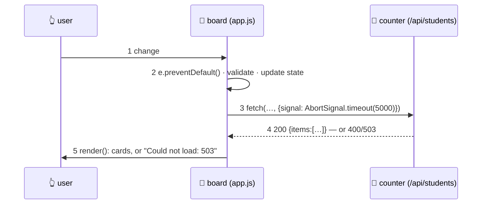

# ⚡ Lesson 04 — JavaScript & events: the board comes alive

**📍 You are here:** Lesson **04** of 12 · Previous: `lesson-03-css-layout` · Next: `lesson-05-state-components`

---

## 📦 What's in this branch

Lessons 01–03, **plus** behaviour: finding elements, listening for
**events**, changing the **DOM**, and calling the counter with **fetch** —
including the three faces of every request.

## 🧒 Explain like I'm 5

A pinned-up board is a poster. To make it a *board people use*, three things
have to happen:

1. **Listen** 👂 — "when the class filter changes…", "when the form is
   submitted…". That is `addEventListener`. The form one starts with
   `e.preventDefault()`, because a form's default is to reload the whole page.
2. **Decide** 🧠 — read what changed, check the form is valid, ask the
   counter for data.
3. **Repaint** 🖼️ — put new cards on the board. We build elements from a
   `<template>` and set `textContent` (never `innerHTML` with data — that is
   how a student called `` runs code on your board; lesson 11).

Talking to the counter is `fetch`, and it always has **three faces**:
**loading** (say so, and mark the list busy), **success** (draw the cards),
**error** (say what went wrong, kindly). A board that only draws the success
face is a board that shows an empty page whenever the counter sneezes.

## 🗺️ Diagram



## ❓ What

- **Finding**: `document.querySelector('#id')`, `querySelectorAll`. Cache
  what you use repeatedly.
- **Events**: `el.addEventListener('click' | 'change' | 'submit' | 'input', fn)`.
  The handler gets an `event`: `e.target`, `e.preventDefault()`,
  `e.stopPropagation()`. Events **bubble** up the tree — one listener on a
  list can serve every card (delegation).
- **Changing the DOM**: `textContent` (safe), `replaceChildren(...nodes)`
  (replace a whole list in one go), `classList.toggle`, `el.hidden`,
  `template.content.cloneNode(true)`.
- **fetch + async/await**: `const r = await fetch(url)`; check `r.ok`
  (a 404 does **not** throw!); `await r.json()`. Always a timeout
  (`AbortSignal.timeout`), always `try/catch/finally`.
- **Forms**: `new FormData(form)` → `Object.fromEntries(…)`;
  `input.checkValidity()` gives you the browser's own validation.
- **Modules & scope**: our file is wrapped in an IIFE with `"use strict"` so
  nothing leaks to the global page; real apps use `<script type="module">`.

## 🤔 Why

Because this is the loop every interactive page runs, forever: *event →
change something → repaint*. Frameworks make the repaint automatic (lesson
07), but they do not change the loop — and when something misbehaves, you
debug it at this level.

## 🔧 How (in this repo)

[ui/app.js](../../ui/app.js) sections 3 and 4: `load()` and `enrol()` do the
fetching (with timeout, `r.ok` check and a `finally` that always clears
loading); the two `addEventListener` calls at the bottom of section 4 are the
only places the board reacts to a human.

## 🧪 Try it

```bash
python3 ui/mock_api.py
# 1) see all three faces — in ui/app.js change API to '/api/students?slow=1', reload: "Loading…" for 2.5 s
#    then '?fail=1': "Could not load: 503 Service Unavailable". Put it back.
# 2) delete e.preventDefault() in the submit handler, enrol someone, and watch the page reload (and lose the message)
# 3) add a listener of your own: a "Clear" button that resets state.filter and calls render()
# 4) in DevTools → Console:  document.querySelectorAll('.card').length
```

## ✅ Verify — what you should see

With `?slow=1` the list dims (`aria-busy`) and the status says "Loading…";
with `?fail=1` you get a red "Could not load: 503" and no blank page. Without
`preventDefault` the URL gains `?name=…` and everything resets — the default
you were suppressing.

## 🏁 What you just proved

You wired a human action to a state change to a repaint, and you saw a request
fail *safely* — the difference between a demo and a usable board.

## ⚠️ Common mistakes

- forgetting `e.preventDefault()` on form submit
- assuming `fetch` throws on 404/500 — it only rejects on network errors; check `r.ok`
- `innerHTML = userText` (XSS — lesson 11)
- no timeout, so a hung counter hangs the board forever
- adding listeners inside `render()` — they pile up on every repaint

> 🏭 **Why this matters in production:** the most common front-end bug report is "it just spins". Almost always: no timeout, no `r.ok` check, or no error face. The `try/catch/finally` in this lesson prevents all three.

## ⏭️ Next

The board works — but the truth is scattered across the DOM. **State and
components**: one source of truth, and UI = render(state).

```bash
git checkout lesson-05-state-components
```
