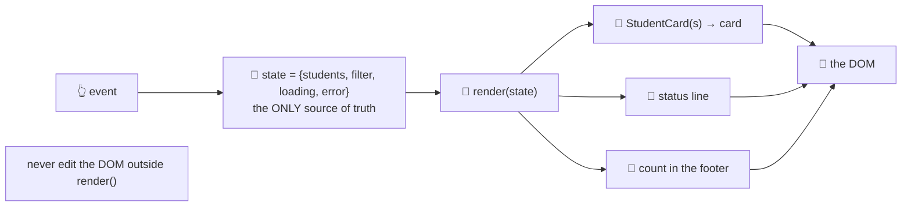

# 🧠 Lesson 05 — State & components: one source of truth

**📍 You are here:** Lesson **05** of 12 · Previous: `lesson-04-javascript-events` · Next: `lesson-06-accessibility`

---

## 📦 What's in this branch

Lessons 01–04, **plus** the idea every framework exists to automate:
**state** (the master list), **components** (functions from data to DOM),
and the one rule — **UI = render(state)**.

## 🧒 Explain like I'm 5

Here is the trap. The board shows five students. A new one is enrolled, so
you append a card. But the footer says "5 students on the board" — update
that too. And the filter is on 3B, so maybe the card should not show at all.
And the empty-state message is still hidden… Three places now know a piece
of the truth, and next week one of them will disagree.

The cure is a **master list** 🧠 kept in one object:

```js
const state = { students: [], filter: "", loading: true, error: null };
```

Nothing else remembers anything. When something happens you change *state*
and call **one** function — `render()` — which draws the whole board from
the current state: the cards, the status line, the count. The board can never
disagree with itself, because there is only one source of truth.

And the drawing is split into **components** 🧩 — small functions that turn
one piece of data into one piece of DOM: `StudentCard(s)` takes a student and
returns a card. Same input, same output, no surprises.

**UI = render(state).** Write it on a sticky note. Every framework in lesson
07 is a clever, fast way of doing exactly this.

## 🗺️ Diagram



## ❓ What

- **State**: plain data describing what the board should show *right now* —
  server data (`students`), UI state (`filter`), request state (`loading`,
  `error`). Derive everything else (the filtered list, the count) inside
  `render()`.
- **Components**: `function StudentCard(student) → Element`. Pure: no
  fetching, no global state, no side effects. Easy to test (lesson 10).
- **The rule**: handlers change state, then call `render()`. Nothing else
  writes to the DOM. Our `render()` uses `replaceChildren(...)` to swap the
  whole list at once.
- **Derived state is not state**: do not store `filteredStudents` — compute
  it. Two copies of one truth always drift.
- **Performance**: rebuilding a small list is cheap. When it is not, you
  either key and diff (what React does) or update surgically — but only after
  measuring (lesson 09).
- **Persisting** a little UI state (the theme) is fine in `localStorage` —
  wrapped in `try/catch`, because private browsing can throw.

## 🤔 Why

Because "the counter said 5 but I see 6" is the most common class of UI bug,
and it is caused by more than one thing remembering the same fact. This one
rule removes the whole category — and it is the exact mental model you will
carry into React, Vue or Svelte next lesson.

## 🔧 How (in this repo)

[ui/app.js](../../ui/app.js) sections 1 and 2: `state` at the top,
`StudentCard(s)` and `render()` below it. Notice `render()` reads
`state.filter` to decide which cards to draw and writes the status text and
the footer count — three views, one truth.

## 🧪 Try it

```bash
python3 ui/mock_api.py
# 1) prove the rule holds: enrol a student while the filter is on 3A — the count updates, the card appears only if it matches
# 2) break it on purpose: in the submit handler, replace `state.students.push(s); render();`
#    with `document.querySelector('#student-list').appendChild(StudentCard(s));`
#    then change the filter — your student vanishes, and the footer count is wrong. That is the bug this lesson kills.
# 3) put it back, then add real state: a `sort` field ('name' | 'grade'), a <select> that sets it, and one line in render()
# 4) in the Console:  state   (it is inside the IIFE — so expose it temporarily with window.state = state to inspect)
```

## ✅ Verify — what you should see

With the rule: every change to state repaints a consistent board. With the
hand-edit: the card exists in the DOM but not in state, so the next `render()`
erases it and the count was never right. Your new sort control needs exactly
one line in `render()` and no other changes.

## 🏁 What you just proved

One object held the truth, one function drew it, and adding a feature meant
touching state and `render()` — not hunting for every place that shows a
number.

## ⚠️ Common mistakes

- editing the DOM outside `render()` (the bug you just created on purpose)
- storing derived data (`filteredStudents`, `count`) in state
- one giant `render()` that rebuilds heavy things every keystroke — split components, or debounce input
- keeping state in globals scattered across files
- reaching for a framework before you have felt why this rule exists

> 🏭 **Why this matters in production:** React's `useState`, Vue's `ref` and Svelte's `$state` are this lesson with a diffing engine attached. Teams that understand it debug frameworks; teams that do not fight them.

## ⏭️ Next

The board is consistent — but can *everyone* use it? **Accessibility**:
keyboard, labels, contrast, focus and announcements.

```bash
git checkout lesson-06-accessibility
```
