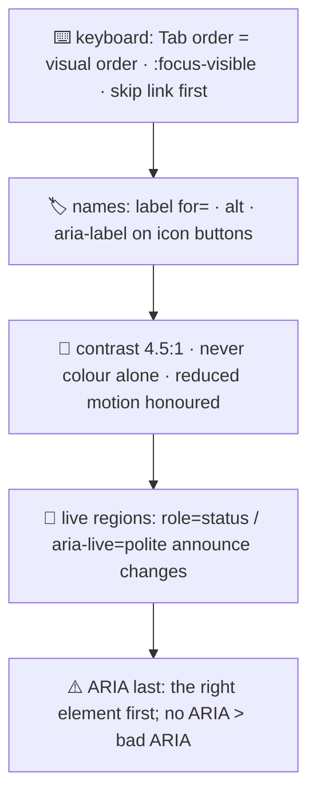

# ♿ Lesson 06 — Accessibility: everyone can read the board

**📍 You are here:** Lesson **06** of 12 · Previous: `lesson-05-state-components` · Next: `lesson-07-frameworks`

---

## 📦 What's in this branch

Lessons 01–05, **plus** the lesson that decides whether the board works for
*everyone*: the **keyboard**, **names** for every control, **contrast**,
**focus**, **live regions**, and the honest rules for **ARIA**.

## 🧒 Explain like I'm 5

Imagine reading the board with the lights off, using a helper who reads it
aloud (a screen reader). Or with hands that cannot use a mouse, so you move
with **Tab** and press with **Enter**. Or in bright sun, where pale grey text
on white disappears.

A board that works for all of them is not a special version — it is the same
board, built right:

- **Keyboard** ⌨️ — Tab reaches every control, in the order things appear;
  the focused thing is *obviously* focused (`:focus-visible`); the first Tab
  offers a **skip link** so nobody has to walk through the nav every time.
- **Names** 🏷️ — every input has a `<label>`; every image has `alt`; an
  icon-only button has `aria-label`. If the helper cannot say what a control
  is, it does not exist.
- **Contrast + not colour alone** 🎨 — body text at 4.5:1 against its
  background; never "the red ones are errors" without words or an icon.
- **Announcements** 📣 — when the board changes *without* a page reload
  (cards loaded, "Zoya is on the board", "Could not load"), a **live region**
  (`role="status"` / `aria-live="polite"`) tells the helper. Our status line
  and form message are exactly that.
- **Motion** — honour `prefers-reduced-motion`; animation can make people ill.

And the first rule of **ARIA**: *no ARIA is better than bad ARIA.* Use the
right element first (lesson 02); reach for `aria-*` only to say something HTML
cannot.

## 🗺️ Diagram



## ❓ What

- **Focus order** follows DOM order. Do not use `tabindex` greater than 0;
  `tabindex="0"` makes a custom control focusable, `-1` makes it
  programmatically focusable only.
- **Roles, names, values**: assistive tech sees a control's *role* (button),
  *name* ("Enrol") and *state* (`aria-pressed="true"` on our theme toggle).
  Semantic HTML provides all three; ARIA patches gaps.
- **Live regions**: `aria-live="polite"` waits for a pause; `role="alert"`
  (our form message) interrupts. Only announce what matters.
- **`aria-busy="true"`** on a list while it loads tells the helper not to
  read a half-drawn list.
- **Contrast**: 4.5:1 for normal text, 3:1 for large text and UI borders —
  DevTools shows the ratio in the colour picker.
- **Testing**: keyboard-only pass; a screen reader (VoiceOver ⌘F5, NVDA,
  Narrator); automated checks (axe, Lighthouse) catch maybe 30% — the rest is
  the keyboard pass you just did.
- **The law**: WCAG 2.2 AA is the common standard (and a legal requirement in
  many places).

## 🤔 Why

Because a board that excludes people is broken for them completely, not
slightly. Because everything here also helps everyone else: keyboard support
helps power users, contrast helps sunlight, live regions help slow networks,
and semantics make your tests robust. And because it is far cheaper to keep
than to retrofit.

## 🔧 How (in this repo)

The board ships with a `.skip` link (visible only on focus), `:focus-visible`
outlines, labels for every control, `alt` on avatars (`alt=""` — the name is
right next to them), `role="status" aria-live="polite"` on the list status,
`role="alert"` on the form message, `aria-busy` on the list while loading, and
`aria-pressed` on the theme toggle.

## 🧪 Try it

```bash
python3 ui/mock_api.py
# 1) keyboard only — no mouse at all: Tab (skip link) → Enter → filter a class → Tab to the form → enrol a student
# 2) screen reader: macOS ⌘F5 (VoiceOver) or Windows Narrator. Listen to the list, the labels, and the message after enrolling.
# 3) break a name: remove aria-label from the theme button and hear "button" with no name. Put it back.
# 4) contrast: DevTools → pick .status colour → the contrast ratio is shown. Try making --muted lighter and see it fail.
# 5) the robot pass:
python3 ui/smoke_test.py      # lang, one h1, labels, alt, skip link + live region
```

## ✅ Verify — what you should see

You completed an enrolment without touching the mouse, and the focus ring was
visible at every step. The screen reader announced "Zoya is on the board"
because the message lives in a live region. The smoke test's five a11y checks
pass.

## 🏁 What you just proved

The same board serves mouse, keyboard and screen-reader users — because the
HTML means what it says and changes are announced.

## ⚠️ Common mistakes

- `outline: none` with nothing to replace it — keyboard users lose their place
- `aria-label` on a `<div>` pretending to be a button instead of using `<button>`
- `aria-live="assertive"` everywhere (it interrupts constantly)
- colour as the only signal for errors
- testing only with an automated tool and declaring victory

> 🏭 **Why this matters in production:** accessibility audits, procurement requirements and lawsuits are real, but the everyday reason is simpler: a meaningful fraction of your users need this, and they will simply leave a board they cannot operate.

## ⏭️ Next

Part 2 begins: shipping the board. First, **frameworks** — what React, Vue
and Svelte automate, and when vanilla is enough.

```bash
git checkout lesson-07-frameworks
```
