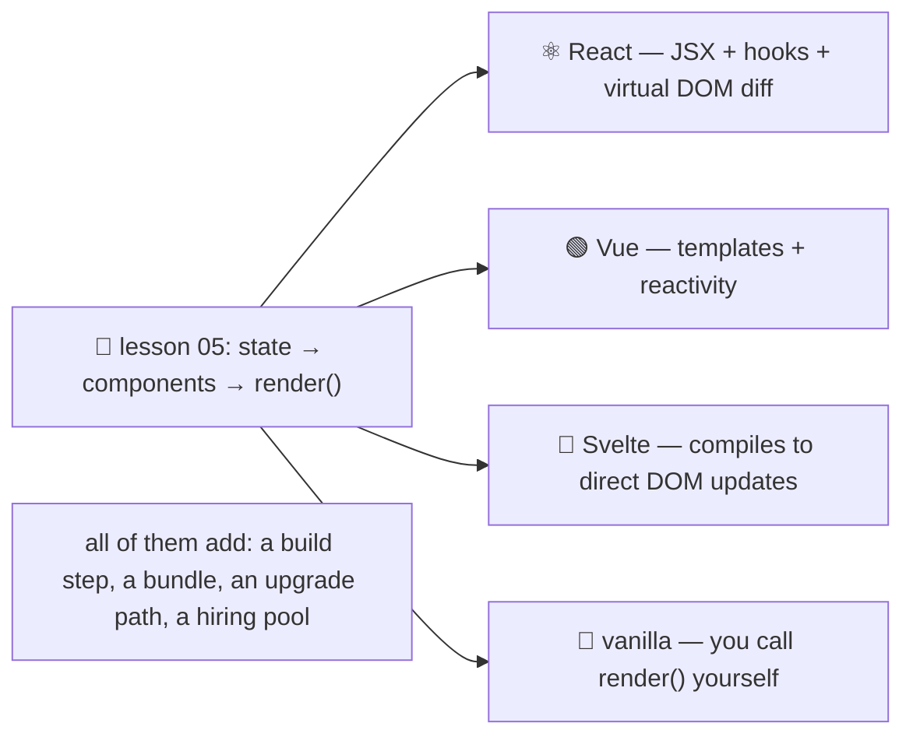

# 🧰 Lesson 07 — Frameworks: the same ideas, automated

**📍 You are here:** Lesson **07** of 12 — Part 2 begins! · Previous: `lesson-06-accessibility` · Next: `lesson-08-design-tokens`

---

## 📦 What's in this branch

Lessons 01–06, **plus** the honest tour of **React**, **Vue** and
**Svelte**: what they automate (everything in lesson 05), what they cost,
and when the three plain files you already have are the right answer.

## 🧒 Explain like I'm 5

You built the board by hand. Every time state changed you called `render()`,
which rebuilt the list. That works beautifully for five cards. For five
hundred cards, twenty components and six people editing them, two problems
appear: rebuilding everything is wasteful, and "remember to call `render()`"
is a rule humans forget.

A **framework** 🧰 takes over exactly that: you declare what the UI *should*
look like for a given state, and it works out the smallest set of DOM changes
— automatically, every time state changes. That is all. The mental model you
learned in lesson 05 does not change; it gets an engine.

- **React** ⚛️ — components are functions returning JSX; `useState` holds
  state; changing it re-runs the function and React diffs the result. Biggest
  ecosystem, most jobs, most concepts (hooks, effects, keys).
- **Vue** 🟢 — single-file components (template + script + style); reactive
  refs; the template updates when the data does. Gentle on-ramp.
- **Svelte** 🧡 — a compiler: your component *compiles away* into direct DOM
  updates, so there is no runtime diffing. Small bundles, plain-looking code.
- **Vanilla** 🍦 — what you have. Zero bytes, zero build, nothing to upgrade.

The rule of thumb: **stay vanilla until three components share state.** Then
pick by team and ecosystem, not by benchmark.

## 🗺️ Diagram



## ❓ What

- **What every framework gives you**: automatic re-render on state change,
  component composition, keyed list diffing, event binding, and usually a
  router and a build toolchain.
- **JSX** is a syntax for "what this component returns"; it is not HTML —
  `className`, `onClick`, and expressions in `{}`.
- **Keys**: when rendering lists, frameworks need a stable `key` per item to
  move DOM nodes instead of rebuilding them (our `student.id`).
- **Costs**: a build step (Vite, Next, Nuxt, SvelteKit), bundle weight
  shipped to every visitor, version upgrades, and framework-specific bugs.
- **Server-side rendering / meta-frameworks** (Next.js, Nuxt, SvelteKit) put
  the first paint back on the server — the SPA trade-off from the
  trade-offs page.
- **You can mix**: a mostly-static site with one interactive island (a web
  component or a small mount point) is a perfectly good architecture — it is
  what this School's own pages do.

## 🤔 Why

Because "which framework" is the loudest question in front-end and almost
never the important one. The important one is whether you understand
state → view, keys, and what you are shipping to a phone. You now do — so you
can pick a framework for real reasons, or decline one with confidence.

## 🔧 How (in this repo — the translation exercise)

Our `StudentCard` and `render()` map one-to-one onto framework code. In React
the same board is roughly:

```jsx
function StudentCard({ s }) {                 // our StudentCard(s)
  return <li className="card"><strong>{s.name}</strong> <span>class {s.class}</span></li>;
}
function Board() {
  const [students, setStudents] = useState([]);   // our state.students
  const [filter, setFilter] = useState("");       // our state.filter
  useEffect(() => { fetch("/api/students").then(r => r.json()).then(d => setStudents(d.items)); }, []);
  const rows = students.filter(s => !filter || s.class === filter);   // derived, not stored (lesson 05!)
  return <ul className="cards">{rows.map(s => <StudentCard key={s.id} s={s} />)}</ul>;
}
```

No `render()` call anywhere: `setStudents` *is* the call.

## 🧪 Try it

```bash
# 1) on paper (10 min): translate the enrol form into React — which lines are state, which are the component,
#    where does e.preventDefault() go, and what replaces our manual render()?
# 2) count the cost: our board ships ~9 KB of HTML+CSS+JS, uncompressed and unminified.
wc -c ui/index.html ui/styles.css ui/app.js
#    a "hello world" React app ships ~140 KB of framework before your code. Both numbers are fine — know which you are paying.
# 3) the honest test: does your next feature need shared state across three components? If not, stay vanilla.
```

## ✅ Verify — what you should see

Your React sketch has the same four pieces as `app.js` (state, component,
derived list, effect that fetches) and no manual repaint. The byte count shows
the board is a few kilobytes in total.

## 🏁 What you just proved

Frameworks automate lesson 05 rather than replacing it — so you can read any
of them, and justify choosing none.

## ⚠️ Common mistakes

- picking a framework by benchmark instead of by team and ecosystem
- reaching for one before the third shared-state component
- storing derived data in state (the same bug, now with hooks)
- missing or index-based `key`s in lists — subtle, ugly reordering bugs
- shipping a meta-framework to serve a five-page static site

> 🏭 **Why this matters in production:** framework choice outlives most of the team. The teams that stay productive are the ones who understand the ideas underneath, so they can upgrade, migrate or opt out without a rewrite.

## ⏭️ Next

However you render it, the board needs one look: **design systems and
tokens** — colours, spacing, type and dark mode from one sheet.

```bash
git checkout lesson-08-design-tokens
```
