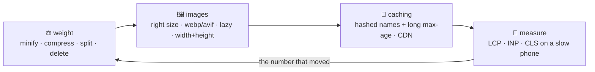

# 🚀 Lesson 09 — Performance: the board loads fast

**📍 You are here:** Lesson **09** of 12 · Previous: `lesson-08-design-tokens` · Next: `lesson-10-testing`

---

## 📦 What's in this branch

Lessons 01–08, **plus** why boards feel slow and what actually fixes it:
**fewer bytes**, **honest images**, **caching**, and the three numbers that
describe speed as a person experiences it — **Core Web Vitals**.

## 🧒 Explain like I'm 5

A board is slow for boring reasons: it is **heavy** (too much to download),
it **waits** (one file blocks the next), or it **jumps around** while
loading. Each has a boring fix:

- **Weight** ⚖️ — send less. Minify and compress (gzip/brotli), split code so
  a page loads only what it needs, and delete the library you used once. A
  framework is ~140 KB before your code; our whole board is ~9 KB.
- **Images** 🖼️ — usually the heaviest thing on any board. Right size (not a
  4000px photo in a 200px card), modern format (WebP/AVIF), `loading="lazy"`
  for anything below the fold, and **always** `width`/`height` so the layout
  does not jump when they arrive.
- **Caching** 🧊 — the fastest file is the one already on the reader's
  machine. Hash the filename (`app.7f3c2a.js`), cache it for a year, and
  change the name when the content changes. A CDN keeps it near the reader.

Then measure what a person feels — **Core Web Vitals**:
**LCP** (how soon the biggest thing appears), **INP** (how quickly taps
respond), **CLS** (how much things jump). Measure on a **throttled phone**,
not on your laptop.

## 🗺️ Diagram



## ❓ What

- **The critical path**: HTML → CSS (render-blocking) → JS. Keep CSS small
  and early; load JS with `defer`/`type=module` so parsing is not blocked.
- **LCP** ≤ 2.5 s: usually a hero image or heading — preload it, do not lazy
  load it. **INP** ≤ 200 ms: keep main-thread work short (long tasks block
  taps). **CLS** ≤ 0.1: reserve space for images, ads and late fonts.
- **Fonts**: `font-display: swap`, subset, self-host or preconnect; a late
  webfont is a classic CLS and LCP problem. (Our board uses system fonts —
  zero bytes, instant.)
- **Caching headers**: `Cache-Control: max-age=31536000, immutable` for
  hashed assets; short or `no-cache` for HTML. This is the API school's
  lesson 10 seen from the browser side.
- **Measure**: DevTools → Lighthouse (lab) and the Performance panel with
  CPU/network throttling; `PerformanceObserver` or a RUM tool for real users
  (lesson 12).
- **Do not guess**: the fix is whichever number is bad. Optimising a 9 KB
  bundle while a 2 MB hero image loads is theatre.

## 🤔 Why

Because speed is a feature people feel before they notice any other one, and
because the median phone on the median network is far slower than your
machine. Every second of load costs conversions in every study anyone has run
— and on a school board, it costs a parent who gives up.

## 🔧 How (in this repo)

The board is fast by having little: three files, system fonts, inline SVG
avatars (no image requests at all), no framework, no build. That is the
cheapest performance strategy there is — and the baseline you compare against
when a real project gets heavy.

## 🧪 Try it

```bash
python3 ui/mock_api.py
# 1) the honest baseline:
wc -c ui/index.html ui/styles.css ui/app.js     # ~9 KB total, uncompressed
# 2) Lighthouse: DevTools → Lighthouse → Mobile → Analyze. Note LCP, CLS, and the score.
# 3) feel a slow network: DevTools → Network → throttle to "Slow 4G", reload. Then Performance → CPU 4× slowdown.
# 4) create CLS on purpose: remove width="40" height="40" from the card  in index.html, reload on Slow 4G —
#    watch the cards shift as avatars arrive. Put them back.
# 5) create a long task: in the Console run  let t=Date.now(); while(Date.now()-t<800){}  and try clicking during it — that is bad INP.
```

## ✅ Verify — what you should see

Lighthouse gives the board a high performance score with an LCP well under
2.5 s. Removing the image dimensions makes the layout visibly jump on a slow
connection (and CLS rises); restoring them fixes it. The busy-loop makes the
page unresponsive for the better part of a second — the thing INP measures.

## 🏁 What you just proved

You measured the board the way a user experiences it, and you caused and cured
a layout shift and a blocked main thread on purpose.

## ⚠️ Common mistakes

- optimising bundle size while a huge unoptimised image dominates LCP
- lazy-loading the hero image (it is the LCP element — load it eagerly)
- no `width`/`height` on images (CLS)
- caching HTML for a year (nobody ever sees the new version)
- testing only on a fast laptop on office wifi

> 🏭 **Why this matters in production:** Core Web Vitals are field-measured by browsers and used by search ranking; more importantly they match what people complain about. "It feels slow" becomes an actionable number in this lesson.

## ⏭️ Next

Fast and pretty is not enough if it breaks on the next change: **testing UI**
— unit, component, end-to-end and the smoke test you already have.

```bash
git checkout lesson-10-testing
```
