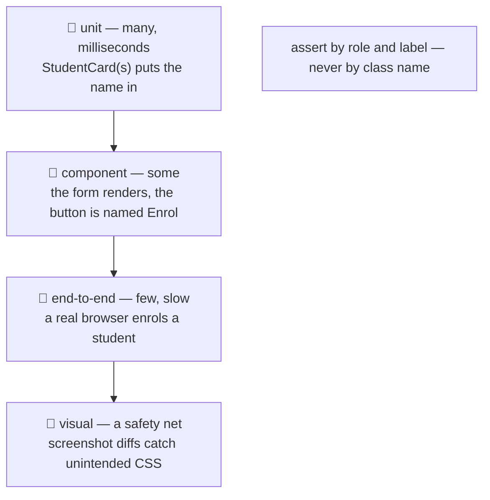

# 🧪 Lesson 10 — Testing UI: does the board still stand?

**📍 You are here:** Lesson **10** of 12 · Previous: `lesson-09-performance` · Next: `lesson-11-talking-to-backends`

---

## 📦 What's in this branch

Lessons 01–09, **plus** how to change the board without breaking it: the
**test pyramid** for UI (unit, component, end-to-end, visual), what to assert
(**roles and labels**, not class names), and the zero-dependency **smoke
test** that already guards this repo. Real files:

- [ui/smoke_test.py](../../ui/smoke_test.py) — ten checks, no dependencies
- [ui/tests/board.spec.js](../../ui/tests/board.spec.js) — the same intent in Playwright

## 🧒 Explain like I'm 5

Before anyone repaints the board, someone should check it still works. There
are four kinds of check, and you want different amounts of each:

- **Unit** 🔬 — test a pure function on its own. `StudentCard(s)` with test
  data: does it put the name in? Fast, plentiful.
- **Component** 🧩 — render a piece with fake data and assert on the DOM
  ("there is a button named Enrol"). Still fast; catches real wiring.
- **End-to-end** 🧭 — a *real browser* opens the board, fills the form,
  clicks Enrol, and checks the card appears. Slow, occasionally flaky,
  priceless. Keep a handful of golden paths.
- **Visual** 📸 — screenshot the board and diff it against yesterday's, to
  catch the CSS nobody meant to change.

And the one rule for *what* to assert: **ask the way a user asks.** "The
button named Enrol", "the field labelled Name" — not `.btn-primary` or
`#f3 > div:nth-child(2)`. Tests written in user language survive redesigns and
double as an accessibility check: if the test cannot find the control by its
name, neither can a screen reader (lesson 06).

## 🗺️ Diagram



## ❓ What

- **The pyramid**: many cheap tests at the bottom, a few expensive ones at
  the top. Inverted pyramids (all end-to-end) are slow and flaky; no top at
  all means integration bugs ship.
- **Tools**: Vitest/Jest (unit), Testing Library (component — its whole
  philosophy is `getByRole`/`getByLabelText`), Playwright or Cypress
  (end-to-end), Playwright/Percy (visual).
- **Our zero-dependency version**: `ui/smoke_test.py` fetches the page and
  asserts on structure (lang, one `h1`, labels for inputs, alt on images, the
  skip link, the live region), the tokens in the CSS, and the API's success
  and failure shapes. Ten checks, one exit code — perfect for CI.
- **In CI** (the [CI/CD school](https://baluraut.github.io/learn-cicd-school/)):
  start the server, run the checks, fail the build on a non-zero exit.
- **Accessibility testing**: axe-core as a library, or Lighthouse in CI —
  automated tools catch roughly a third; the keyboard pass catches the rest.
- **Flakiness**: wait for *conditions* (an element appearing), never for a
  fixed number of milliseconds.

## 🤔 Why

Because UI is the layer people change most often and trust least, and because
"I clicked around and it looked fine" does not scale past one person. A
ten-check smoke test that runs in two seconds prevents the embarrassing
class of bug: a missing label, a broken endpoint, a typo in a token.

## 🔧 How (in this repo)

`ui/smoke_test.py` uses only `urllib` and `re`: it asserts the HTML's
semantics, the CSS's tokens and focus style, and hits the API twice — once
expecting students, once expecting a `400` for a bad form. `ui/tests/board.spec.js`
shows the same two journeys in Playwright, written with `getByRole` and
`getByLabel`.

## 🧪 Try it

```bash
python3 ui/mock_api.py &
python3 ui/smoke_test.py; echo "exit code: $?"          # 🎉 the board stands · 0
# 1) break something and watch it fail:
#    remove alt="" from the card  in index.html → ❌ images have alt, exit 1
# 2) add YOUR check to smoke_test.py (3 lines): the enrol form has a submit button
#    check("form has a submit button", 'type="submit"' in html)
# 3) add a check that the dark theme tokens exist for [data-theme="dark"]
# 4) read ui/tests/board.spec.js and notice: getByRole('button', {name: 'Enrol'}), getByLabel('Name') —
#    the same words a screen reader would say
```

## ✅ Verify — what you should see

`🎉 the board stands` and exit code `0` on a healthy board; a named ❌ line and
exit `1` after you remove the `alt`. Your two new checks appear in the list and
pass.

## 🏁 What you just proved

Ten seconds of checks catch the mistakes that hurt most, and tests written in
user language double as accessibility tests.

## ⚠️ Common mistakes

- asserting on class names or DOM paths — every redesign breaks the suite
- only end-to-end tests (slow, flaky) or only unit tests (integration bugs ship)
- `sleep(2000)` instead of waiting for a condition
- snapshot tests of giant HTML blobs that nobody reads when they change
- testing the framework instead of your behaviour

> 🏭 **Why this matters in production:** the front end is where the most frequent, most visible regressions live. A tiny smoke test in CI is the highest-value testing anyone adds to a UI repo — it is why this one ships with it.

## ⏭️ Next

The board is tested; now make it talk to the world safely: **talking to
backends** — CORS, tokens, loading and error states, XSS.

```bash
git checkout lesson-11-talking-to-backends
```
