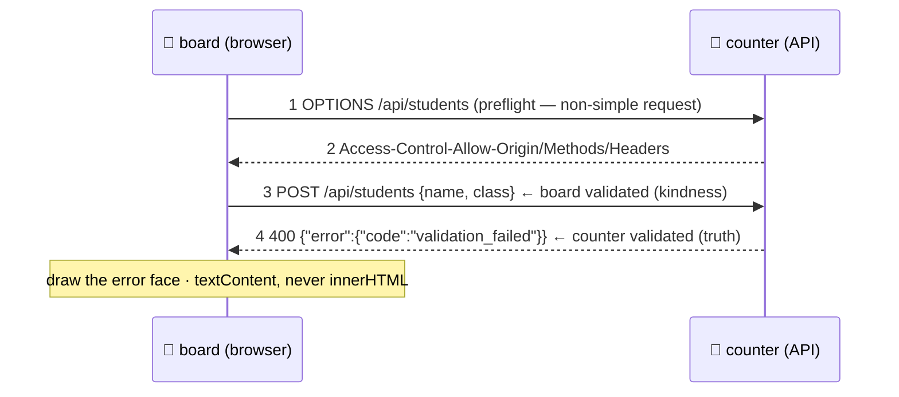

# 📨 Lesson 11 — Talking to backends: filling in the counter's slips

**📍 You are here:** Lesson **11** of 12 · Previous: `lesson-10-testing` · Next: `lesson-12-build-deploy-observe`

---

## 📦 What's in this branch

Lessons 01–10, **plus** the boundary between board and counter: **CORS**,
**credentials in a browser**, the **three faces** of every request, and the
two security rules — **never trust the board**, **never inject text as HTML**.

## 🧒 Explain like I'm 5

The board fills in slips at the counter (the
[API school](https://baluraut.github.io/learn-api-school/)). Four things are
different because the board runs **inside a stranger's browser**:

1. **CORS** 🚧 — the browser will not let a page at one origin read a
   response from another unless the counter says it may
   (`Access-Control-Allow-Origin`). For anything beyond a simple `GET`, the
   browser asks permission first (an `OPTIONS` **preflight**). Our little
   counter answers both.
2. **Nothing in the browser is secret** 🪪 — every byte you ship can be read.
   No API keys in JavaScript. Users get **short-lived tokens** (or an
   `httpOnly` cookie the JS cannot read); long-lived machine keys stay on
   servers.
3. **Three faces, always** ⏳ — loading, success, error. A board that only
   draws success shows a blank page whenever the counter is slow or down.
4. **Never trust the board** 🛡️ — your form validation is a *kindness* to
   users; anyone can send a raw request. The counter validates again and
   returns `400` with problems (API school lesson 04). And the reverse:
   never put counter text into the page with `innerHTML` — a student named
   `` would run code. `textContent`, always.

## 🗺️ Diagram



## ❓ What

- **Origin** = scheme + host + port. Different origin → CORS applies.
  **Simple** requests (GET/POST with basic content types) go straight out;
  anything else preflights with `OPTIONS`.
- **Credentials**: `fetch(url, {credentials: 'include'})` sends cookies
  cross-origin — and then the counter must name the exact origin (not `*`)
  and set `Access-Control-Allow-Credentials`.
- **Token storage**: `localStorage` is readable by any script that gets
  injected (XSS); `httpOnly` cookies are not readable by JS but need CSRF
  protection (`SameSite=Lax/Strict`). Short expiry either way.
- **The three faces** in code: set `loading` → render; `try` the fetch,
  check `r.ok`, parse; `catch` sets `error`; `finally` clears `loading` and
  renders. Give the error face a *retry*.
- **XSS defences**: `textContent`/`createElement` (or a framework's escaping),
  a **Content-Security-Policy** header, and never `innerHTML`,
  `eval`, or `new Function` with data.
- **Timeouts and retries** belong on the client too (API school lesson 10):
  `AbortSignal.timeout`, and backoff for `429`/`5xx`.

## 🤔 Why

Because this boundary is where the two most common front-end security
incidents live (a leaked key shipped in a bundle; an XSS through user text),
and where the most common *reliability* complaint lives ("it just spins" —
no timeout, no error face). Three of the four rules cost one line each.

## 🔧 How (in this repo)

[ui/app.js](../../ui/app.js): `load()` and `enrol()` show the three faces;
`StudentCard` uses `textContent` for every user-supplied value.
[ui/mock_api.py](../../ui/mock_api.py) sets the CORS headers, answers
`OPTIONS`, **re-validates** the form server-side, and offers `?slow=1` and
`?fail=1` so you can see each face on demand.

## 🧪 Try it

```bash
python3 ui/mock_api.py
# 1) the three faces: edit API in app.js to '/api/students?slow=1' (loading), then '?fail=1' (error), then back
# 2) never trust the board — bypass the form entirely:
curl -s -X POST http://127.0.0.1:8000/api/students -H 'Content-Type: application/json' -d '{"name":"X","class":"9Z"}'
#    → 400 validation_failed. The counter refused what the board never would have sent.
# 3) XSS, safely: enrol a student named  <b>bold</b>  — the card shows the literal text (textContent).
#    Then temporarily use innerHTML in StudentCard and enrol    — see it fire. Undo it.
# 4) CORS: open the board from a different origin (python3 -m http.server 9001 in ui/) and watch the console —
#    then notice mock_api.py's Access-Control-Allow-Origin header is what makes the fetch work at all.
```

## ✅ Verify — what you should see

Loading and error faces appear on demand and never leave a blank page. The raw
`curl` gets `400 validation_failed` — proof the counter does not trust the
board. The `<b>bold</b>` student renders as text with `textContent` and as
markup (or worse) with `innerHTML`.

## 🏁 What you just proved

The board handles every outcome of a request, and you demonstrated both
security rules — server-side validation and escaping — from both sides.

## ⚠️ Common mistakes

- API keys or secrets in front-end code or `.env` files that get bundled
- `innerHTML` with anything a user or API supplied
- trusting client-side validation (a `curl` bypasses it in one line)
- `Access-Control-Allow-Origin: *` together with credentials (browsers refuse it, for good reason)
- no timeout, no error face, no retry

> 🏭 **Why this matters in production:** XSS and leaked keys are the two front-end items on every security checklist, and "the page spins forever" is the most common support ticket. Four rules, four lines, most of the risk.

## ⏭️ Next

The last mile: **build, deploy and observe** — pinning the board up where
people can see it, and watching what happens.

```bash
git checkout lesson-12-build-deploy-observe
```
