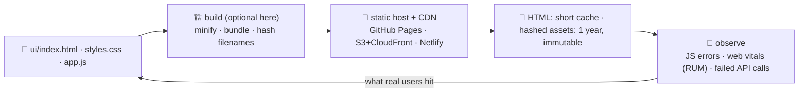

# 🚚 Lesson 12 — Build, deploy & observe: pinning the board up

**📍 You are here:** Lesson **12** of 12 — the final lesson! · Previous: `lesson-11-talking-to-backends`

---

## 📦 What's in this branch

The complete course, **plus** the last mile: what a **build** does, how a
board is **deployed** (it is just files), **cache busting** so people see the
new version, and **observing** real users — plus the capstone.

## 🧒 Explain like I'm 5

The board works on your desk. To put it on the wall where everyone can see
it, three things happen:

1. **Build** 🏗️ — bundle and minify the files, and give each one a name
   containing a hash of its contents: `app.7f3c2a.js`. (Our board needs no
   build at all — three plain files — which is a perfectly good answer for a
   small board.)
2. **Deploy** 🚚 — copy the files to a static host and let a **CDN** keep
   copies near readers: GitHub Pages, S3 + CloudFront, Netlify, Cloudflare
   Pages. A board is *just files*; there is no server to run.
3. **Cache busting** 🧊 — the HTML is cached briefly, the hashed files
   forever. A new build makes new names, so nobody ever sees a half-old
   board. (This is why lesson 09's "cache for a year" is safe.)

Then you **watch** 👀: JavaScript errors from real browsers, the Core Web
Vitals of real users on real phones, and how often the counter's calls fail.
Because the board lives on a thousand devices you do not own.

## 🗺️ Diagram



## ❓ What

- **What a build does**: bundle modules, minify, tree-shake, transpile for
  older browsers, inline critical CSS, emit hashed filenames and a manifest.
  Tools: Vite, esbuild, Parcel, Rollup.
- **Static hosting**: no server process, no patching; the CDN handles TLS,
  compression and edge caching. SPA routing needs a rewrite rule so deep
  links serve `index.html`.
- **Cache strategy**: `index.html` → `no-cache` (or a short max-age);
  `/assets/app.<hash>.js` → `max-age=31536000, immutable`.
- **Environments**: preview deploys per pull request (the CI/CD school's
  gates), then production. Config for the API base URL comes from the build,
  and contains **no secrets** (lesson 11).
- **Observability**: `window.onerror` / `unhandledrejection` → an error
  service; `PerformanceObserver` for LCP/INP/CLS from real users (RUM);
  a request id per API call to join front-end and back-end logs (API school
  lesson 12).
- **Rollback**: redeploy the previous build — with hashed assets, both
  versions can coexist safely.

## 🤔 Why

Because a board nobody can reach is not a board, and because the two classic
deploy bugs are entirely preventable: people seeing a stale page (bad cache
headers) and a broken release nobody noticed (no error reporting). Both are
solved with settings, not cleverness.

## 🔧 How (in this repo)

This very School is the demonstration: every course site is static files on
GitHub Pages, deployed on push. Your board can go up the same way — no
framework, no server, one command.

## 🧪 Try it — the capstone

```bash
# 1) deploy the board (5 minutes, free):
#    - copy ui/ into docs/app/ of your fork, commit and push
#    - GitHub → Settings → Pages → Source: main /docs
#    - open https://<you>.github.io/<repo>/app/  → your board, on the internet
#    (the counter is local-only, so point API at a deployed one or ship a static fallback list)
# 2) see caching in action: DevTools → Network, reload twice — the second load shows "(disk cache)" for styles.css
# 3) add crash reporting in 6 lines, in app.js:
#      window.addEventListener('error', e => navigator.sendBeacon('/api/log', JSON.stringify({msg: e.message, src: e.filename, line: e.lineno})));
#      window.addEventListener('unhandledrejection', e => console.warn('unhandled', e.reason));
# 4) measure a real vital in the browser:
#      new PerformanceObserver(l => l.getEntries().forEach(e => console.log('LCP', Math.round(e.startTime), 'ms'))).observe({type:'largest-contentful-paint', buffered:true});
# 5) 🏆 THE CAPSTONE — add a homework list to the board, end to end:
#      HTML section with a heading and a list (L02) · layout in the grid (L03) · state.homework + a component + render (L04–05)
#      · labels, live region, keyboard pass (L06) · tokens only, works in dark mode (L08) · lazy/sized images if you add any (L09)
#      · three new smoke checks (L10) · fetch from /api/homework with loading and error faces, textContent only (L11) · deployed (L12)
```

## ✅ Verify — what you should see

Your board answers on a public URL. The second reload serves CSS from the disk
cache. The error listener fires when you throw something in the console, and
the observer prints an LCP in milliseconds. The capstone board passes
`smoke_test.py` — including your three new checks — with the homework list
working in both themes and from the keyboard alone.

## 🏁 What you just proved

You took a board from three files on your laptop to a public, cached,
observed URL — and added a whole feature through every layer of the course.

## ⚠️ Common mistakes

- caching `index.html` for a long time (nobody sees the new build)
- unhashed asset names with long cache times (stale JS with fresh HTML — the worst combination)
- secrets in the build config (they ship to every visitor)
- no error reporting — you learn about breakage from users
- deploying without a rollback plan; with hashed assets, keeping the old build is free

> 🏭 **Why this matters in production:** front-end deploys are the most frequent deploys a company does. Static hosting plus hashed assets plus real-user monitoring is the boring setup that makes them uneventful.

## 🎓 The board is yours

The notice board → semantic skeleton → layout that bends → events → one source
of truth → everyone can read it → frameworks, understood → the uniform →
fast → tested → talking safely to the counter → pinned up and watched.
**You didn't just learn UI — you run a board.** 📌🎓

The whole school, end to end: the
[Database school](https://baluraut.github.io/learn-database-school/) keeps the
truth, the [API school](https://baluraut.github.io/learn-api-school/) answers
the slips, this board shows it to people, and the
[CI/CD school](https://baluraut.github.io/learn-cicd-school/) pins it up on
every push.

```bash
git checkout main
python3 ui/mock_api.py     # one last look at the board
```
